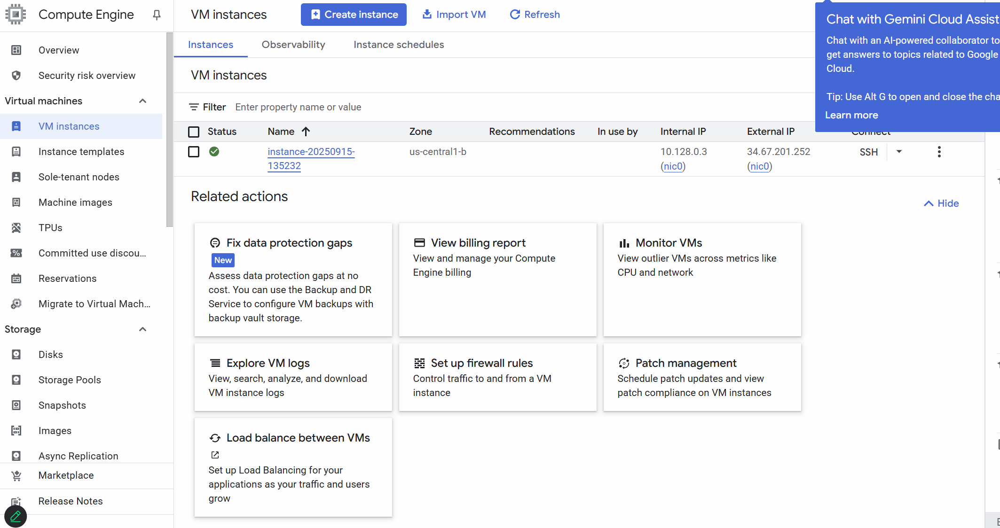
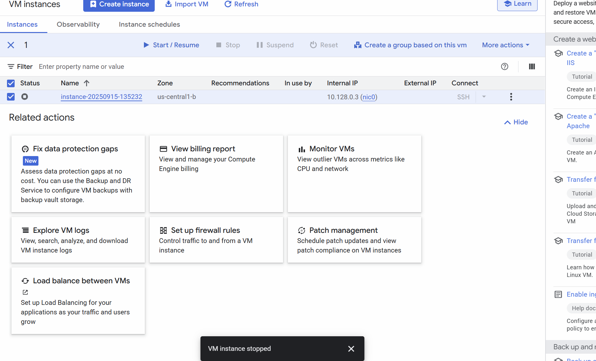
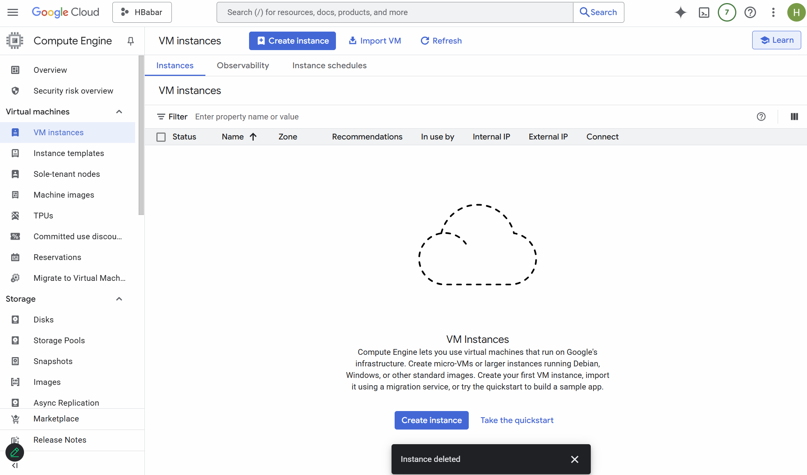
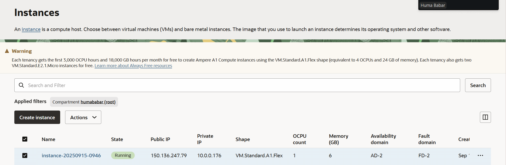
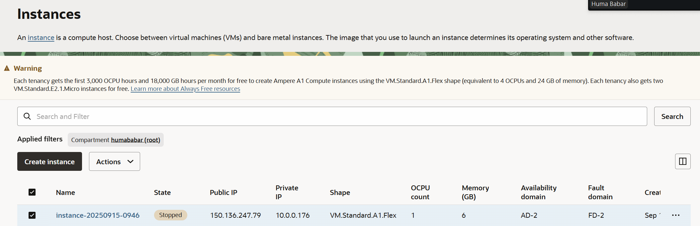
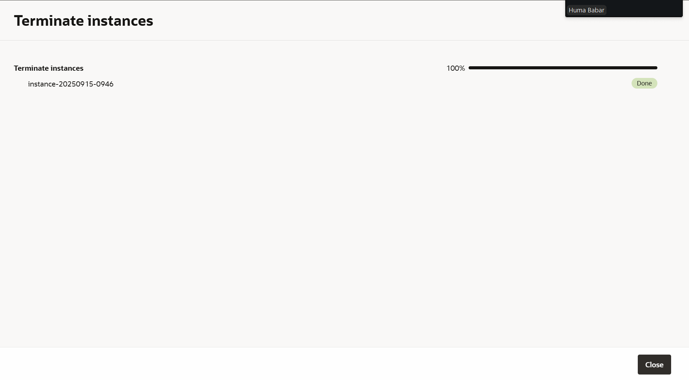
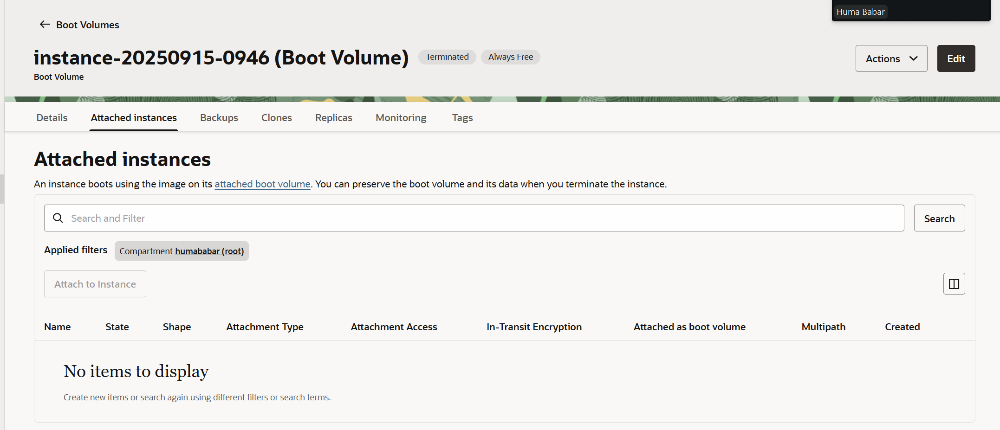

# VM Lifecycle on GCP and OCI — Tutorial

## Video
Loom/Zoom: [VM Lifecycle Tutorial](assignment_1/video2920590959.mp4)

## Prereqs
- Cloud access to GCP and OCI
- No PHI/PII; smallest/free-tier shapes

---

## Google Cloud (GCP)
### Create
1. Console → Compute Engine → Create instance
2. Region/zone: <us-central1b>
3. Machine type: <E2.Micro>
4. Image: Ubuntu LTS
5. Boot disk: default minimal
6. Network: default VPC; ephemeral public IP

### Start/Stop
- Start:

- Stop:

### Delete
- Delete instance and verify no disks/IPs remain

---

## Oracle Cloud (OCI)
### Create
1. Compartment: humababar (root)
2. Networking: VCN with Internet Connectivity (defaults)
3. Shape: VM.Standard.A1.Flex
4. Image: Ubuntu
5. Public IP: ephemeral
6. Boot volume: default minimal

### Start/Stop
- Start: <state shows RUNNING>

- Stop: 

### Terminate
- Terminate and delete boot volume; verify cleanup

---

## Reflections
### Similarities
- Both have "create instances" button 
- Choosing an OS image and shape
- Adding SSH key pairs
- Both allow us to create small free tier VMs

### Differences
- The GCP layout is easier to understand/use
- In GCP you choose specific regions/zones
- In OCI there is a drop down bar for start stop and terminate while in GCP each action has a separate button 
- GCP uses machine types while OCI uses shapes for their vm

### Preference (OCI vs GCP) and Why
- I prefer using GCP because it is more user-friendly and has a better clean up process when terminating a vm. GCP will also show you how many credits you have left in your billing account for students. 
