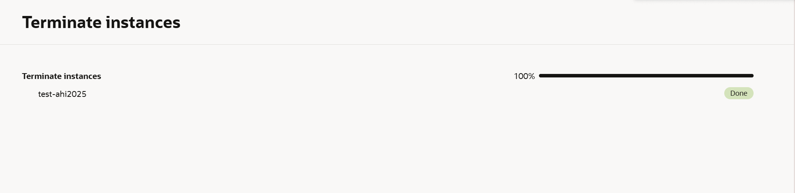

# VM Lifecycle on GCP and OCI — Tutorial

## Video
Loom/Zoom: [VM Lifecycle Tutorial](https://drive.google.com/file/d/1m4hDOGO8tKH3R-98T-m6qQ832lKdJW5k/view?usp=sharing) 
Zoom: [OCI Clean up](https://drive.google.com/file/d/18b4k8t5noMsza9N9SFDHPnhy7Zvi6GpP/view?usp=sharing)
(I made a small clip to show another way we can double check our clean up in OCI by going into boot volume attachments)
## Prereqs
- Cloud access to GCP and OCI
- No PHI/PII; smallest/free-tier shapes

---

## Google Cloud (GCP)
### Create
1. Console → Compute Engine → Create instance: test-ahi
2. Region/zone: us-central1b
3. Machine type: E2.Micro
4. Image: Ubuntu LTS (after this selection leave everything as is)
5. Boot disk: default minimal
6. Network: default VPC; ephemeral public IP

### Start/Stop
- Start:

- Stop:

### Delete
- Delete instance and verify no disks/IPs remain

---

## Oracle Cloud (OCI)
### Create
1. Compartment: humababar (root)
2. Shape: VM.Standard.A1.Flex
3. Image: Ubuntu (Canonical Ubuntu 22.04 Minimal aarch64)
4. Public IP: ephemeral
5. Security: leave as default
6. Networking: primary network = Create new virtual cloud network. Subnet: Create new public subnet
7. Boot volume: default minimal

### Start/Stop
- Start: <state shows RUNNING>

- Stop: 

### Terminate
- Terminate and delete boot volume; verify cleanup

### Verify Cleanup

---

## Reflections
### Similarities
- Both have a "create" button
- Choosing an OS image and shape
- Adding SSH key pairs
- Both allow us to create small free tier VMs

### Differences
- The GCP layout is easier to understand/use
- In GCP you choose specific regions/zones
- GCP's button says "create a VM" but OCI's says "create instance"
- In OCI there is a drop down bar for start stop and terminate while in GCP each action has a separate button 
- GCP uses machine types (like E2) while OCI uses shapes for their vm
- In GCP when you select a shape like Ubuntu, GCP assigns you a version but in OCI you have to futher select an image name, only selecting Ubuntu is not sufficient. 
- Terminated vm is visibly present for some time in OCI but immediately gone in GCP.
- In GCP after when you remove a vm the term is "delete" but in OCI it is "terminate."

### Preference (OCI vs GCP) and Why
- Even though OCI looks better graphically, I prefer using GCP because it is more user-friendly and has a better clean up process when terminating a vm. For example, when terminating a vm on OCI it still lives there giving users the chance to review the vm and restore if needed. It hard deletes after a couple of hours while in GCP the terminated vm is deleted right away. Additionally, I like how symbols are used in GCP. When a vm is "running" there is a green check symbol next to the instance name and when the vm is "stopped" there is a gray pause symbol. GCP will also show you how many credits you have left in your billing account for students. 
